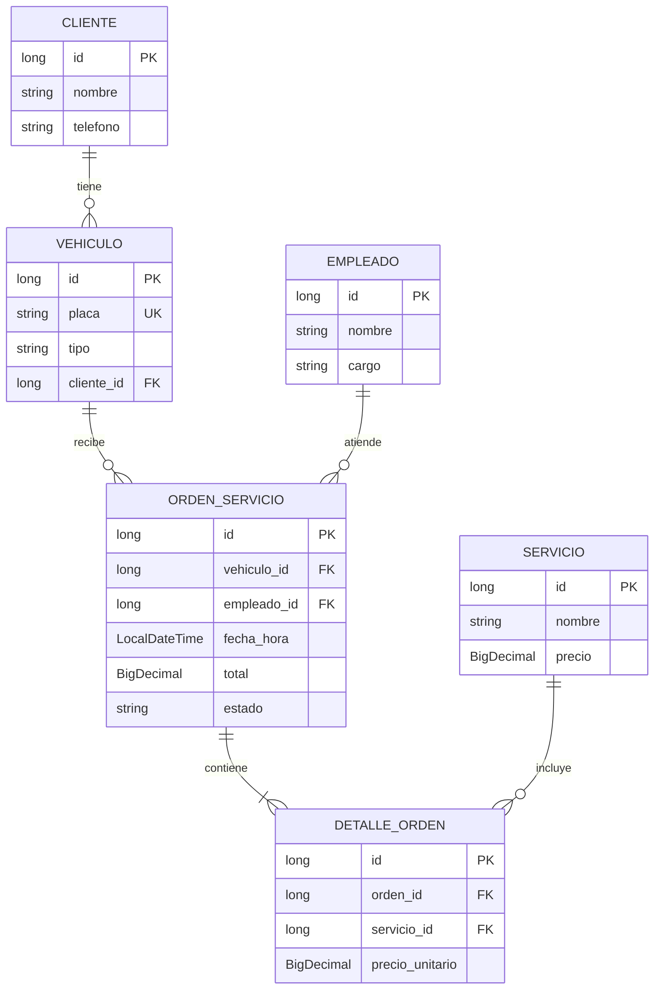

```mermaid
erDiagram
    CLIENTE {
        long id PK
        string nombre
        string telefono
    }
    
    EMPLEADO {
        long id PK
        string nombre
        string cargo
    }

    VEHICULO {
        long id PK
        string placa UK
        string tipo
        long cliente_id FK
    }

    SERVICIO {
        long id PK
        string nombre
        BigDecimal precio
    }

    ORDEN_SERVICIO {
        long id PK
        long vehiculo_id FK
        long empleado_id FK
        LocalDateTime fecha_hora
        BigDecimal total
        string estado
    }

    DETALLE_ORDEN {
        long id PK
        long orden_id FK
        long servicio_id FK
        BigDecimal precio_unitario
    }

    CLIENTE ||--o{ VEHICULO : "tiene"
    VEHICULO ||--o{ ORDEN_SERVICIO : "recibe"
    EMPLEADO ||--o{ ORDEN_SERVICIO : "atiende"
    ORDEN_SERVICIO ||--|{ DETALLE_ORDEN : "contiene"
    SERVICIO ||--o{ DETALLE_ORDEN : "incluye"
```